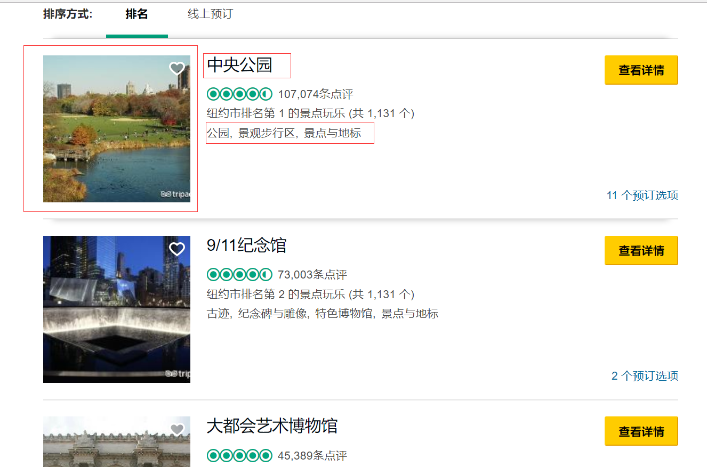

# BeautifulSoup实现简单爬取  

BeautifulSoup是一个智能的处理工具，用户只要将抓取到的网页源码交给它，然后告诉它：我要img标签，而且只要宽度为180的img标签。它就会直接把符合的标签拿给你，当说：我只要里面的文字，它也会会很智能地把文字提取出来。    

## 1.爬取tripadvisor网站简单例子    

### 1.网站外形：   

   		

	爬取的目标是：每一页的标题、标签、图片地址（爬取失败）   

### 2.爬取源码   

```python
from bs4 import BeautifulSoup
import requests

url = 'https://www.tripadvisor.cn/Attractions-g60763-Activities-New_York_City_New_York.html'
wd_data = requests.get(url)
soup = BeautifulSoup(wd_data.text,"lxml")
titles = soup.select("div.listing_title > a[target='_blank']")
imgs = soup.select('img[width="180"]')  #图片做了反爬处理，通过js加载出来
for title,img in zip(titles,imgs):
    data = {
        'title':title.get_text(),   #获取文本内容
        'img':img.get('src'),     #获取src的内容
    }
    print(data)
```

#### 1.request请求    

request有两种请求方式：get & post , (  ``r = requests.post("http://httpbin.org/post")``   )   

请求的过程中还可以传参数 & 设置编码:   

```python
payload = {'key1': 'value1', 'key2': ['value2', 'value3']}
r = requests.get('http://httpbin.org/get', params=payload)

r.encoding = 'ISO-8859-1'
```

### 3.使用BeautifulSoup      

将数据放进BeautifulSoup中，从中select出需要的信息

```python
soup = BeautifulSoup(wd_data.text,"lxml")
titles = soup.select("div.listing_title > a[target='_blank']")
imgs = soup.select('img[width="180"]')  #图片做了反爬处理，通过js加载出来
```

### 4.json方式存储数据    

```python
for title,img in zip(titles,imgs):
    data = {
        'title':title.get_text(),   #获取文本内容
        'img':img.get('src'),     #获取src的内容
    }
```

_当我们把信息抽取出来后，他们就是单纯的一整块的信息。而传输他们一般都要你把他们整理好再给它。整理的模板就是“标签 - 内容”。所以我们就可以把所有的图片的地址添加img的标签，以此来存储。_

### 5.包装成方法

包装成方法非必要步骤，但可以方便程序的多次调用。

1. 在前面添加方法名：

```python
def get_attractions(url,data=None):
    ...
```

_定义方法名称，还有传进去的参数为url_   

1. 调用方法：

```python
get_attractions(url)
```

_调用名称，传进url_   

## 2.分页爬取tripadvisor网站

### 1.定义规律的url

1. 观察连接变化，发现其oa后面的数字每页以30递增：

``https://www.tripadvisor.cn/Attractions-g60763-Activities-oa90-New_York_City_New_York.html#ATTRACTION_LIST``

所以编写递增数组：

```python
urls = ['https://www.tripadvisor.cn/Attractions-g60763-Activities-oa{}-New_York_City_New_York.html#ATTRACTION_LIST'.format(str(i)) for i in range(0,930,30)]
```

用{}作为占位符  

_定义一大堆有规律的数组很麻烦，所以python就想到用一个规律的式子代表所有的元素。range（30，930，30）说明从30开始，到930，步长为30。所以打印出来的数字将会是0，30，60，90，120..._   

### 2.调用方法，传入url

```python
for single_url in urls:
    get_attractions(single_url)
```

为了躲避封号等反爬措施，需要添加``time.sleep(2)   # 保护措施`` 进行访问的间断。

爬到的东西：

```python
{'title': '中央公园', 'img': 'https://cc.ddcdn.com/img2/x.gif'}
{'title': '9/11纪念馆', 'img': 'https://cc.ddcdn.com/img2/x.gif'}
{'title': '大都会艺术博物馆', 'img': 'https://cc.ddcdn.com/img2/x.gif'}
{'title': '峭石之巅观景台', 'img': 'https://cc.ddcdn.com/img2/x.gif'}
{'title': '曼哈顿天际线', 'img': 'https://cc.ddcdn.com/img2/x.gif'}
{'title': '大中央车站', 'img': 'https://cc.ddcdn.com/img2/x.gif'}
{'title': '高线公园', 'img': 'https://cc.ddcdn.com/img2/x.gif'}
{'title': '百老汇', 'img': 'https://cc.ddcdn.com/img2/x.gif'}
{'title': '帝国大厦', 'img': 'https://cc.ddcdn.com/img2/x.gif'}
...
```

这个地方图片地址被做了反爬措施，为了正确爬取到图片信息，可以从手机页面入手。因为手机的页面的js不会做得那么完整。

### 3.自定义分页范围方法

```python
def get_more_pages(start,end):
    for one in range(start,end):
        get_page(url+str(one))
        time.sleep(2)
```

## 3.模拟手机爬取tripadvisor网站

开发者做的手机版可能就比较随意了，爬取上难度相对低一点。通过传入手机访问的header就可以抓取到手机页面。

### 1.传入header的方式：

```python
headers = {
    'User-Agent':'Mozilla/5.0 (iPhone; CPU iPhone OS 9_1 like Mac OS X) AppleWebKit/601.1.46 (KHTML, like Gecko) Version/9.0 Mobile/13B143 Safari/601.1'
}

url = 'https://www.tripadvisor.cn/Attractions-g60763-Activities-oa30-New_York_City_New_York.html#ATTRACTION_LIST'

mb_data = requests.get(url,headers = headers)
```

在request请求的时候传入头文件的User-Agent   

（很尴尬的是，该页面的手机版也做了相应的反爬手段，爬到的img地址还是一样的...）  


文档地址：https://www.crummy.com/software/BeautifulSoup/bs4/doc.zh/