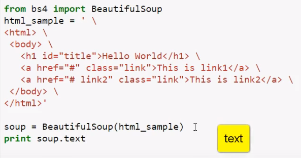

# Python入门    

## 1.环境搭建   

### 1.安装python   

我使用的是python-3.6.3-amd64-webinstall.exe,安装完之后还需要添加环境变量，在path中添加python的安装路径和pip的路径(在python的Scripts里面)，以dos命令下运行``python``不报错来确认安装成功。      

### 2.安装IDE  

 我使用的是JetBrains PyCharm，安装过程比较缓慢   

 破解网站：``http://idea.liyang.io/``   

### 3.安装库  

#### 1.安装一：下载安装  

库的地址：``https://www.lfd.uci.edu/~gohlke/pythonlibs/#lxml``   

1. beautifulsoup4-4.5.3   

   安装方式：

   1. copy文件导python安装目录下   
   2. 使用dos命令cd导beautifulsoup4目录下   
   3. 执行 ``python setup.py install``安装命令       

2. request    

   解压request文件，将其copy到python的lib下完成安装（copy有init.py的文件）   

3. urllib3

4. chardet   

5. certifi   

6. idna   

7. lxml   

8. tornado  


安装是否成功以导入是否报错为准    

#### 2.安装二：命令安装     

```
pip install requests

pip install BeautifulSoup4
```

## 2.BeautifulSoup

**Beautiful Soup** 是一个可以从HTML或XML文件中提取数据的Python库，简单来说，它能将HTML的标签文件解析成树形结构，然后方便地获取到指定标签的对应属性。  

_BeautifulSoup像一个源码阅读者，将需要的信息提取出来给你。_   

  

### 1.DOM操作获取内容   

1. 获取网页源代码，包装为soup    

```python
import requests   
res = requests.get("http://taobao.com")   
soup = BeautifulSoup(res.text)   
...
```

_用request去把网站源码下载来，放进BeautifulSoup工具中_   

2. 从soup中抽取内容

抽取h1 , a     ``soup.select('h1')`` , ``soup.select('a')``   就能拿到带标签的内容    

由于select出来的是List,所以用角标获取内容：``item.select('strong')[0].text``     

_只要告诉soup需要的元素标签/类，它就会把所有的标签拿给你。因为是很多个标签，所以是以List的方式存放。只要添加[0]脚标就可以把第一个元素拿出来。而要拿到标签里面的具体内容，添加text方法就可以了_   

3. 去除空白小操作   

``item.select('strong')[0].text.strip``    

## 3.网站爬取   

### 1.获取网页源码   

```python
from bs4 import BeautifulSoup
import requests

url = 'http://opac.gzlib.gov.cn/opac/search?q=A1&searchType=standard&isFacet=false&view=simple&searchWay=class&rows=10&sortWay=score&sortOrder=desc&libcode=GT&searchWay0=marc&logical0=AND&page=6'
wb_data = requests.get(url)
soup = BeautifulSoup(wb_data.text,'lxml')

print(soup)
```


### 2.获取指定标签对象   

```python
titles = soup.select('div.bookmeta > div > span > a')
print(titles)
```

### 3.遍历获取标签内容   

```python
for title in titles:
    print(title.get_text())
```

### 4.去掉\r，\n，\t ，空行    

```python
    title = title.get_text().replace('\t','').replace('\n','').replace('\r','')
```

```python
    if(author==''):
        continue;
```

### 5.遍历多个参数   

```python
#所有信息进行打包
for title,author in zip(outBlankStrs_title,outEvens_author):
```

### 6.取奇数行   

```python
for index,outBlankStr in enumerate(outBlankStrs_author):
    if index % 2 == 1:
        continue
```

### 7.存入数组  

```python
#处理标题内容
outBlankStrs_title = []
for title in titles:
    title = title.get_text().replace('\t','').replace('\n','').replace('\r','')
    outBlankStrs_title.append(title)
```

### 8.获取动态加载数据   

获取动态js写入的数据，这里就用到selenium+PhantomJS   

1. Selenium安装；

   需要将Python和Selenium进行组合，当然Selenium也提供了基于python的实现，所以就需要把Selenium的包安装到python库中去，以便于python开发时进行调用。

   敲CMD，进入命令窗口，转到D:\Python34\Scripts下，输入命令行：pip install selenium，执行之后，将自动化搜寻最新的selenium版本

2. PhantomJS则是将其解压后的exe文件放在安装包的Scripts文件夹下   

3. 代码实现

```python
from selenium import webdriver
driver = webdriver.PhantomJS()
driver.get('地址')
driver.implicitly_wait(3) #等待加载
elements = driver.find_elements_by_css_selector(".dgrid-content.ui-widget-content")
for element in elements:
    print(element.text)
driver.quit()
```

需要添加等待，否则网页可能加载不完。而find_elements_by_css_selector是通过class定位，其可直接获取几层嵌套内部的text文本。  
